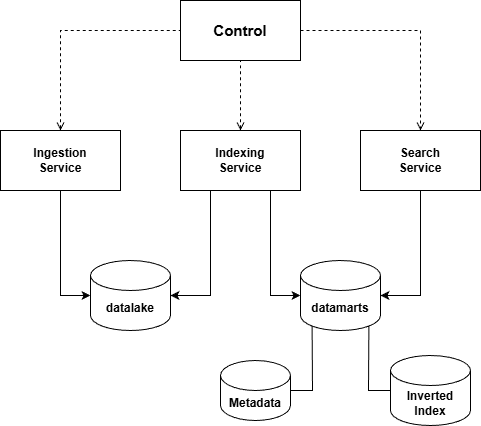

# Book Search Engine - Stage 2

[](https://go-skill-icons.vercel.app/api/)

## 📑 Tabla de contenidos

- [✨ Introducción](#-introducción)
- [🧱 Arquitectura general](#-arquitectura-general)
- [🧠 Principios de diseño](#-principios-de-diseño)
- [📐 Diagrama de arquitectura](#-diagrama-de-arquitectura)
- [📦 Prerrequisitos](#-prerrequisitos)
- [🔨 Compilación](#-compilación)
- [▶️ Ejecución](#️-ejecución)
- [📊 Benchmarks](#-benchmarks)
- [👥 Autores](#-autores)

## ✨ Introducción

Bienvenido al proyecto **Book Search Engine – Stage 2**.
Este repositorio contiene el código fuente y los recursos necesarios para construir un motor de búsqueda escalable y eficiente, compuesto por varios microservicios modulares. Cada módulo se encarga de una fase distinta del pipeline, incluyendo ingestión, indexación, búsqueda y control.

Este README proporciona instrucciones detalladas para compilar, ejecutar, realizar benchmarks y gestionar los distintos componentes, permitiendo a desarrolladores y usuarios comenzar rápidamente y comprender el flujo completo del sistema.

La arquitectura presentada en este stage sienta las bases del sistema, permitiendo su extensión natural hacia una solución distribuida y tolerante a fallos desarrollada en el [**Stage 3**](https://github.com/ayozeruanoalc/stage_3).

## 🧱 Arquitectura general

El sistema sigue una **arquitectura orientada a microservicios**, donde cada servicio es responsable de una etapa específica del procesamiento de datos.

Los componentes principales son:
- **Ingestion Service**: descarga y almacena el contenido bruto de los libros en el datalake.
- **Indexing Service**: procesa los documentos, extrae metadatos y construye el índice invertido.
- **Search Service**: expone la API pública para realizar consultas y filtrado de resultados.
- **Control Module**: coordina y orquesta el flujo completo entre los servicios.

Todos los servicios se comunican mediante **REST APIs** usando mensajes **JSON**, y pueden ejecutarse y desplegarse de forma independiente. Cada uno expone su REST API en un puerto dedicado:

- **Ingestion Service** → `7001`
- **Indexing Service** → `7002`
- **Search Service** → `7003`


## 🧠 Principios de diseño

- Arquitectura modular basada en microservicios.
- Separación clara de responsabilidades entre servicios.
- Uso de **Hexagonal Architecture (Ports & Adapters)** para desacoplar la lógica de negocio de la infraestructura.
- Operaciones de indexación **idempotentes**, evitando duplicados.
- Configuración externa de rutas, bases de datos y parámetros de ejecución.
- Preparación explícita para escalado horizontal y evolución a sistemas distribuidos.

## 📐 Diagrama de arquitectura



## 📦 Prerrequisitos

Instala lo siguiente en tu máquina de desarrollo:

- Java JDK 17
    - Verificación: `java -version`
- Maven 3.6+
    - Verificación: `mvn -v`
- `curl` (para comprobaciones rápidas de endpoints)


## 🔨 Compilación

Dos enfoques habituales:

1) Compilar un microservicio individual (reemplazar `{service-dir}` por el directorio deseado, p.e. `ingestion-service`)
```bash
cd {service-dir}
mvn clean package
```

2) Compilar todo el proyecto multi-módulo desde la raíz
```bash
# from repository root
mvn -T1C -pl ingestion-service,indexing-service,search-service,control clean package
```

Notas:
- `-T1C` habilita compilación paralela utilizando un hilo por núcleo disponible.
- `-pl` permite seleccionar explícitamente los módulos a compilar dentro del proyecto multi-módulo.
- Los JARs se generan en el directorio `target/` de cada servicio. (p.e. `ingestion-service/target/ingestion-service-1.0-SNAPSHOT.jar`).


## ▶️ Ejecución

### Ingestion Service

```bash
# (from repo root or individual service directories)
# Start ingestion-service
java -jar ingestion-service/target/ingestion-service-1.0-SNAPSHOT.jar [datalakePath] [logsFilePath]
```
| Argumento       | Descripción                                                           | Ejemplo                                 |
|-------------------------|-------------------------------------------------------------------------------|-------------------------------------------|
| datalakePath            | Ruta donde se almacenan los archivos                               | `/data/datalake`                | 
| logsFilePath            | Fichero de logs del servicio                             | `/var/log/ingestion.log`                  | 

#### Uso
```bash
curl -X POST http://localhost:7001/ingest/201
```
```json
{"status":"downloaded","book_id":201,"path":"C:/..."}
```
```bash
curl -X GET http://localhost:7001/ingest/status/201
```
```json
{"book_id":201,"status":"available"}
```
```bash
curl -X GET http://localhost:7001/ingest/list
```
```json
{"count":2,"books":[1,201]}
```

### Indexing Service

```bash
# (from repo root or individual service directories)
# Start indexing-service
java -jar indexing-service/target/indexing-service-1.0-SNAPSHOT.jar [datalakePath] [metadataDBPath] [stopWordsReference] [MongoDBName] [MongoDBCollectionName] [MongoDBURI]
```
| Argumento       | Descripción                                                          | Ejemplo                              |
|-------------------------|-------------------------------------------------------------------------------|-----------------------------------------|
| datalakePath            | Ruta del datalake                               | `/data/datalake`              | 
| metadataDBPath            | Base de datos SQLite para metadatos                              | `/metadata/metadata.db`                | 
| stopWordsReference | JSON de stopwords, incluyendo diversos idiomas (archivo disponible en `/resources`)| `indexing-service/src/main/resources/stopwords-iso.json` |
| MongoDBName | Nombre de la DB | `BigData` |
| MongoDBCollectionName | Colección | `InvertedIndex` |
| MongoDBURI | URI MongoDB | `mongodb://localhost:27017` |


#### Uso
```bash
curl -X POST http://localhost:7002/index/update/201
```
```json
{"book_id":201,"index":"updated"}
```
```bash
curl -X POST http://localhost:7002/index/rebuild
```
```json
{"elapsed_time":"1330,4s","books_processed":962}
```
```bash
curl -X GET http://localhost:7002/index/status
```
```json
{"last_update":"2025-11-03T21:48:14.161335400Z","books_indexed":962,"index_size_MB":"480.57"}
```

### Search Service

```bash
# (from repo root or individual service directories)
# Start search-service
java -jar search-service/target/search-service-1.0-SNAPSHOT.jar [metadataDBPath] [MongoDBURI] [MongoDBName] [MongoDBCollectionName] [sortingCriteria]
```
| Argumento       | Descripción                                                            | Ejemplo                              |
|-------------------------|-------------------------------------------------------------------------------|-----------------------------------------|
| metadataDBPath            | Base de datos SQLite (metadatos)                             | `/metadata/metadata.db`              | 
| MongoDBURI           | URI MongoDB                             | `mongodb://localhost:27017`                | 
| MongoDBName | Nombre de la DB | `BigData` |
| MongoDBCollectionName | Colección | `InvertedIndex` |
| sortingCriteria | Indica el modo de orden aplicado sobre los resultados de búsqueda: por bookID / por número de apariciones de una palabra en específico | `id` / `frequency` |


#### Uso
```bash
curl -X GET "http://localhost:7003/search?q=mind"
```
```json
{
  "query": "mind",
  "filters": {},
  "count": 869,
  "results": [
    {
      "id": 100,
      "title": "The Complete Works of William Shakespeare",
      "author": "William Shakespeare",
      "language": "English",
      "year": 1994,
      "frequency": 400
    },
    {
      "id": 145,
      "title": "Middlemarch",
      "author": "George Eliot",
      "language": "English",
      "year": 1994,
      "frequency": 385
    }]
}
```
```bash
curl -X GET "http://localhost:7003/search?q=mind,heart"
```
```json
{
   "query":"mind,heart",
   "filters":{
      
   },
   "count":836,
   "results":[
      {
         "id":100,
         "title":"The Complete Works of William Shakespeare",
         "author":"William Shakespeare",
         "language":"English",
         "year":1994,
         "frequency":400
      },
      {
         "id":145,
         "title":"Middlemarch",
         "author":"George Eliot",
         "language":"English",
         "year":1994,
         "frequency":385
      }]
}
```
```bash
# Un espacio es interpretado como %20 por el comando curl
curl -X GET "http://localhost:7003/search?q=mind&author=William%20Shakespeare&language=English&year=1994"
```
```bash
# Se puede evitar usando un navegador:
http://localhost:7003/search?q=mind&author=William Shakespeare&language=English&year=1994
```
```json
{
   "query":"mind",
   "filters":{
      "year":"1994",
      "author":"William Shakespeare",
      "language":"English"
   },
   "count":1,
   "results":[
      {
         "id":100,
         "title":"The Complete Works of William Shakespeare",
         "author":"William Shakespeare",
         "language":"English",
         "year":1994,
         "frequency":400
      }
   ]
}
```

### Control Module

```bash
# (from repo root or individual service directories)
# Start control
java -jar control/target/control-1.0-SNAPSHOT.jar [stateJSON] [bookID | bookID1 bookID2...]
```
| Argumento      | Descripción                                                            | Ejemplo                                |
|-------------------------|-------------------------------------------------------------------------------|-------------------------------------------|
| stateJSON            | Archivo JSON que controla si un libro ya ha sido indexado                          | `/logs/state.json`                | 
| bookID(s)           | Libro(s) a ser procesado(s) por el pipeline                           | `1` / `1 2 3`                  | 


#### Ejemplos de output
```bash
[STATE] Book 1 -> Stage: INGESTING (not persisted yet)
[STATE] Book 1 -> Stage: INDEXING (saved)
[STATE] Book 1 -> Stage: INDEXED (saved)
{"book_id":1,"status":"ok"}
[STATE] Book 2 -> Stage: INGESTING (not persisted yet)
[STATE] Book 2 -> Stage: INDEXING (saved)
[STATE] Book 2 -> Stage: INDEXED (saved)
{"book_id":2,"status":"ok"}
[STATE] Book 3 -> Stage: INGESTING (not persisted yet)
[STATE] Book 3 -> Stage: INDEXING (saved)
[STATE] Book 3 -> Stage: INDEXED (saved)
{"book_id":3,"status":"ok"}
state_size=3
```

## 📊 Benchmarks


Para evaluar el rendimiento, se realizaron **microbenchmarks y benchmarks de integración** utilizando **[JMH (Java Microbenchmark Harness)](https://openjdk.org/projects/code-tools/jmh/)** — una herramienta oficial de OpenJDK diseñada para la medición precisa del rendimiento de métodos en Java.
Los benchmarks se ejecutaron desde IntelliJ IDEA utilizando el plugin ["JMH Java Microbenchmark Harness"](https://plugins.jetbrains.com/plugin/7529-jmh-java-microbenchmark-harness) de [Sergey Ponomarev](https://plugins.jetbrains.com/vendor/d848ca38-90d6-4adc-86df-9bf931fd8908).

### Configuración

Los benchmarks se ejecutaron bajo las siguientes condiciones:

| Parámetro | Valor                                          |
|------------|-------------------------------------------------|
| **JMH Version** | 1.36                                            |
| **JDK** | OpenJDK 17                                      |
| **Benchmark Mode** | `Throughput` (operaciones por segundo) |
| **Warmup** | 5 iteraciones                                    |
| **Measurement** | 10 iteraciones                                   |
| **Forks** | 1                                               |
| **jvmArgs** | {"-Xmx4G"}                                      |

### Ejecución de microbenchmarks

### Paso de argumentos a los microbenchmarks

Si un benchmark requiere argumentos, basta con modificar la **Run Configuration** del benchmark en IntelliJ, añadiendo los parámetros necesarios según las anotaciones `@Params` del benchmark correspondiente.

Si un benchmark tiene un único `@Param` con valores predefinidos, puede ejecutarse sin especificar argumentos adicionales.

```java
@Param({"10", "100", "1000"})
private int numberOfBooks;
```


Por ejemplo, el `MetadataDatabaseInsertionBenchmark` se puede ejecutar con argumentos de esta manera:
#### MetadataDatabaseInsertionBenchmark

```java
@Param({""})
private String datalakePath;

@Param({""})
private String metadataPath;

@Param({""})
private String idBook;
```


```bash
# Argumentos:
com.guanchedata.benchmark.microbenchmark.indexingservice.databaseinsertion.MetadataDatabaseInsertionBenchmark.*
-p
datalakePath=[datalakePath]
-p
metadataPath=[metadataPath]
-p
idBook=[bookID]
```

| Argumento      | Descripción                           | Ejemplo           |
|---------------|------------------------------------------------|-------------------------|
| datalakePath  | Ruta al directorio del datalake                | `/data/datalake`         |
| metadataPath  | Ruta a la base de datos de metadatos                   | `/metadata/metadata.db`  |
| idBook        | Identificador del libro a procesar                | `201`                   |

### Ejecución de benchmarks de integración

Para ejecutar los benchmarks de integración, es necesario que los tres servicios API (**Ingestion, Indexing y Search**) estén activos.
Una vez iniciados, los benchmarks pueden ejecutarse sin necesidad de especificar argumentos adicionales.

## 👥 Autores

- **Fabio Nesta Arteaga** — 🔗 [GitHub](https://github.com/NestX10)
- **Pablo Cabeza** — 🔗 [GitHub](https://github.com/pabcablan)
- **Joel Ojeda** — 🔗 [GitHub](https://github.com/joelojeda)
- **Enrique Reina** — 🔗 [GitHub](https://github.com/ellupe)
- **Ayoze Ruano** — 🔗 [GitHub](https://github.com/ayozeruanoalc)
